## Part 7. Prometheus и Grafana

**1. Установите и настройте Prometheus и Grafana на виртуальную машину.**

###  Установка Grafana.

- Сначала установила необходимые пакеты командой:

**`sudo apt-get install -y apt-transport-https software-properties-common wget`**

- Затем импортировала GPG ключ.

**`sudo mkdir -p /etc/apt/keyrings/`**

**`wget -q -O - https://apt.grafana.com/gpg.key | gpg --dearmor | sudo tee /etc/apt/keyrings/grafana.gpg > /dev/null`**

- Добавила репозиторий стабильной версии.

**`echo "deb [signed-by=/etc/apt/keyrings/grafana.gpg] https://apt.grafana.com stable main" | sudo tee -a /etc/apt/sources.list.d/grafana.list`**

- Обновила список доступных пакетов.

 **`sudo apt-get update`**

- Затем установила Grafana OSS командой:

 **`sudo apt-get install grafana`**

###  Настройка Grafana.

- Чтобы запустить, использовала команды:

**`sudo systemctl daemon-reload`** 

**`sudo systemctl start grafana-server`**

###  Установка Prometheus.

- Сначала загрузила исходный код и распаковала его.

**`wget https://github.com/prometheus/prometheus/releases/download/v2.45.3/prometheus-2.45.3.linux-amd64.tar.gz`**

**`tar -xvf prometheus-2.45.3.linux-amd64.tar.gz`**

- Создала юзера и необходимые каталоги, сделала созданного пользователя владельцем этих каталогов.

**`sudo useradd --no-create-home --shell /bin/false prometheus`**

**`sudo mkdir /etc/prometheus`**

**`sudo mkdir /var/lib/prometheus`**

**`sudo chown prometheus:prometheus /etc/prometheus`**

**`sudo chown prometheus:prometheus /var/lib/prometheus`**

- Переместила необходимые файлы и папки в соответствующие директории и изменила им владельца на созданного пользователя.

**`sudo cp prometheus-2.45.3.linux-amd64/prometheus /usr/local/bin/`**

**`sudo cp prometheus-2.45.3.linux-amd64/promtool /usr/local/bin/`**

**`sudo chown prometheus:prometheus /usr/local/bin/prometheus`**

**`sudo chown prometheus:prometheus /usr/local/bin/promtool`**

**`sudo cp -r prometheus-2.45.3.linux-amd64/consoles /etc/prometheus`**

**`sudo cp -r prometheus-2.45.3.linux-amd64/console_libraries /etc/prometheus`**

**`sudo chown -R prometheus:prometheus /etc/prometheus/consoles`**

**`sudo chown -R prometheus:prometheus /etc/prometheus/console_libraries`**

- Также скачала node_exporter.

**`wget https://github.com/prometheus/node_exporter/releases/download/v1.7.0/node_exporter-1.7.0.linux-amd64.tar.gz`**

**`tar -xvfz node_exporter-1.7.0.linux-amd64.tar.gz`**

###  Настройка Prometheus.

- Создала файлы с настройками prometheus.yml и prometheus.service.

**`sudo vi /etc/prometheus/prometheus.yml`**

```

global:
  scrape_interval: 10s

scrape_configs:
  - job_name: 'prometheus'
    scrape_interval: 5s
    static_configs:
      - targets: ['localhost:9090']
  - job_name: 'node_exporter'
    static_configs:
      - targets: ['localhost:9100']

```

**`sudo chown prometheus:prometheus /etc/prometheus/prometheus.yml`**

**`sudo vi /etc/systemd/system/prometheus.service`**

```

[Unit]
Description=Prometheus
Wants=network-online.target
After=network-online.target

[Service]
User=prometheus
Group=prometheus
Type=simple
ExecStart=/usr/local/bin/prometheus \
    --config.file /etc/prometheus/prometheus.yml \
    --storage.tsdb.path /var/lib/prometheus/ \
    --web.console.templates=/etc/prometheus/consoles \
    --web.console.libraries=/etc/prometheus/console_libraries

[Install]
WantedBy=multi-user.target

```

- Запустила Prometheus и node_exporter.

**`sudo systemctl daemon-reload`**

**`sudo systemctl start prometheus`**

**`cd node_exporter-1.7.0.linux-amd64`**

**`./node_exporter`**

<br>

**2. Получите доступ к веб-интерфейсам Prometheus и Grafana с локальной машины.**

- Для этого установила режим сетевой мост для сетевого адаптера виртуальной машины.

- Получила ip машины, используя команду:

**`ifconfig`**

- Разрешила подключение к портам 3000, 9090, 9100.

**`sudo firewall-cmd --add-port=3000/tcp --permanent`**

**`sudo firewall-cmd --add-port=9090/tcp --permanent`**

**`sudo firewall-cmd --add-port=9100/tcp --permanent`**

**`sudo firewall-cmd --reload`**

- Затем открыла в браузере на локальной машине страницу "http://192.168.0.208:3000", чтобы открыть Grafana.

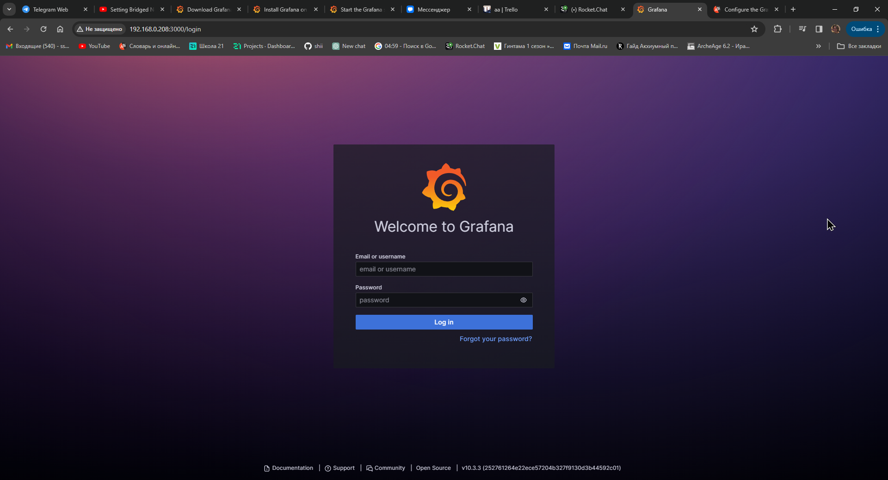

- Prometheus доступен по "http://192.168.0.208:9090".

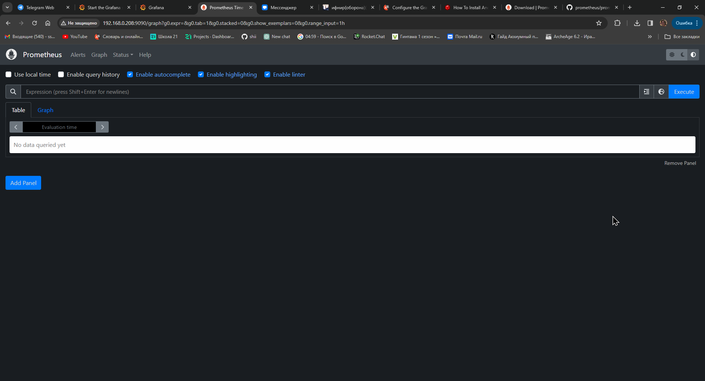

**3. Добавьте на дашборд Grafana отображение ЦПУ, доступной оперативной памяти, свободное место и кол-во операций ввода/вывода на жестком диске.**

- В Grafana зашла по дефолтному имени и паролю "admin". Дальше кликнула на Data Sources, там выбрала Prometheus и настроила URL.

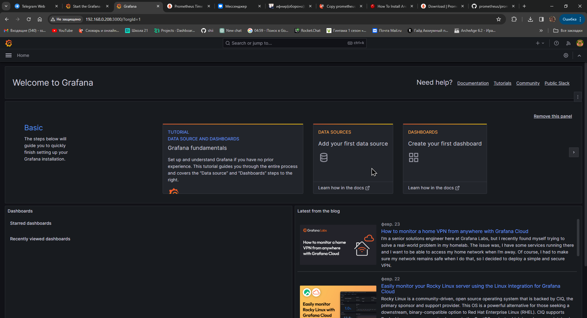

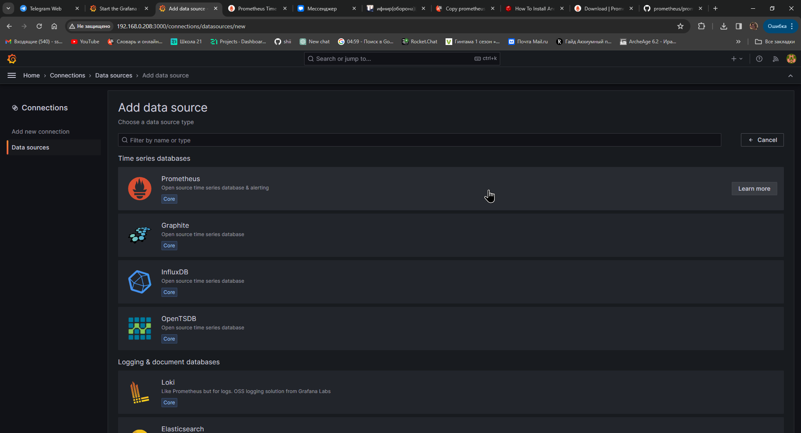

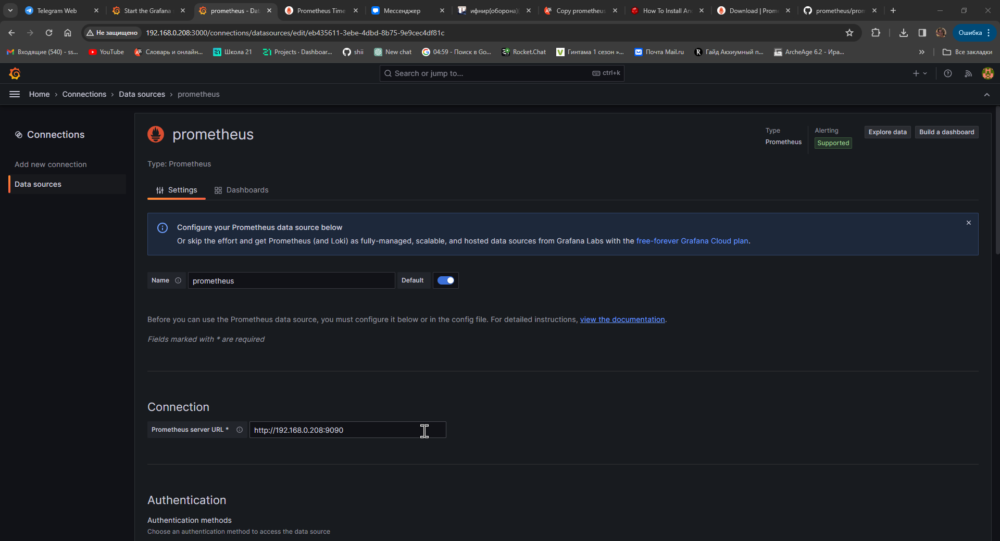

- Затем кликнула создать дашборд, в качестве источника данных выбрала Prometheus.

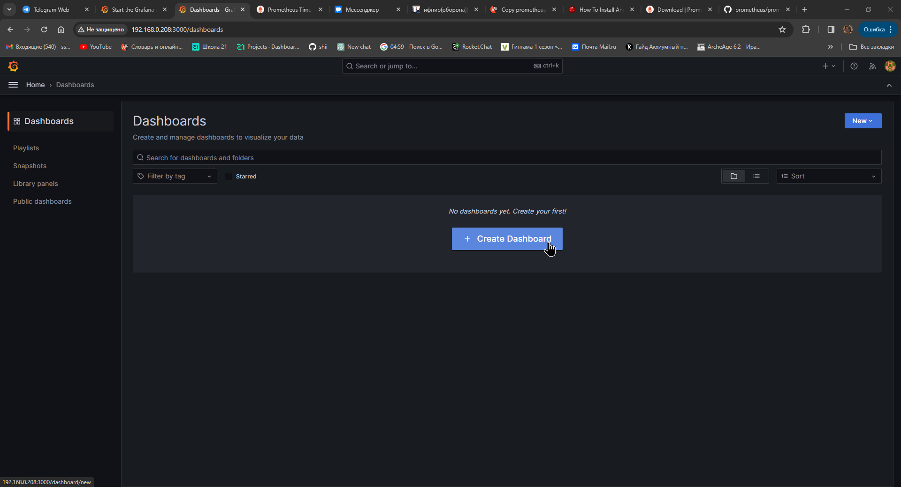

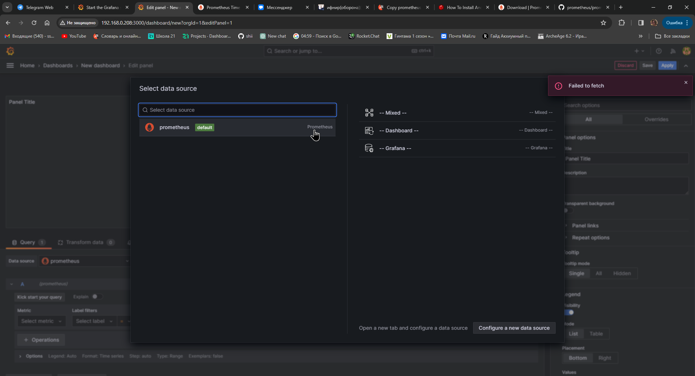

- Для добавления панели нужно кликнуть Add visualization.

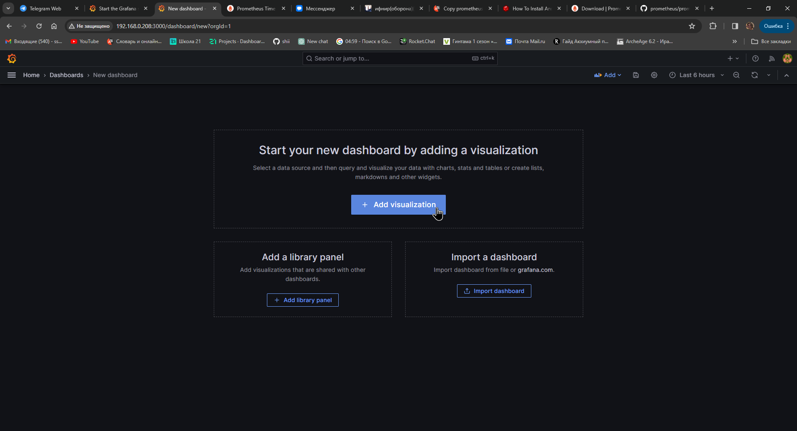

- Готовый дашборд.

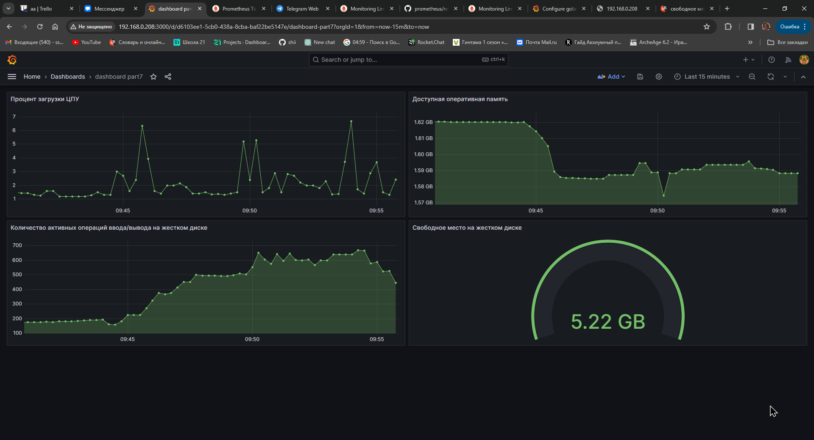

**4-5. Запустите свой bash-скрипт из Части 2. Посмотрите на нагрузку жесткого диска (место на диске и операции чтения/записи).**

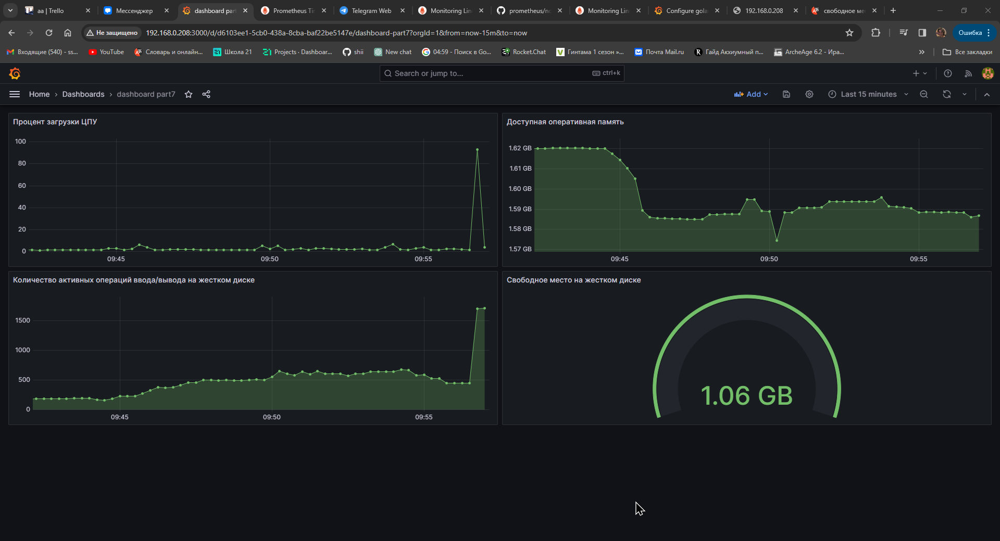

**6-7. Установите утилиту stress и запустите команду **`stress -c 2 -i 1 -m 1 --vm-bytes 32M -t 10s`**. Посмотрите на нагрузку жесткого диска, оперативной памяти и ЦПУ.**

- До запуска утилиты stress.

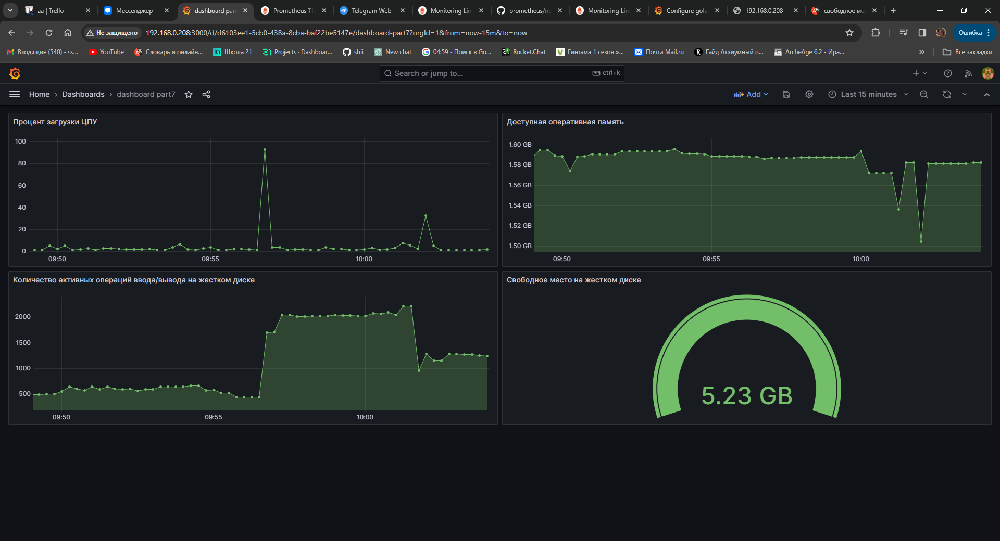

- После запуска.

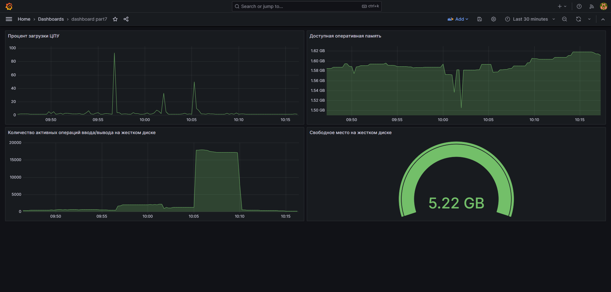