## Part 8. Готовый дашборд

**1. Установите готовый дашборд Node Exporter Quickstart and Dashboard с официального сайта Grafana Labs.**

- Node Exporter Quickstart and Dashboard содержит устаревшие плагины, поэтому у меня не работает. И я импортировала Node Exporter Full. Для этого на сайте Grafana Labs со странички Node Exporter Full скачала JSON.

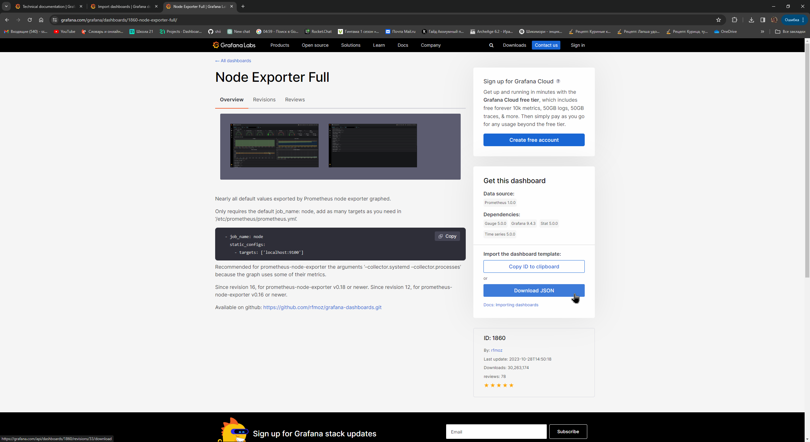

- Затем кликнула создать новый дашборд и выбрала импортировать.

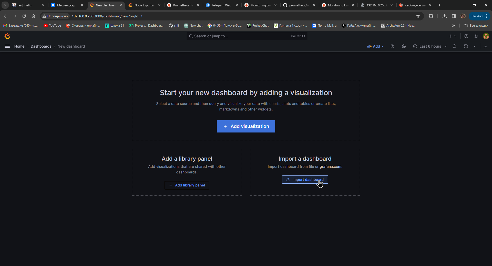

- Загрузила JSON, установила источник данных.

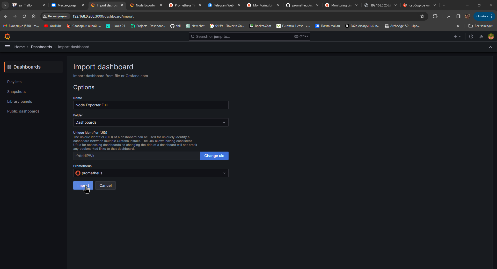

- Отобразился такой дашборд.

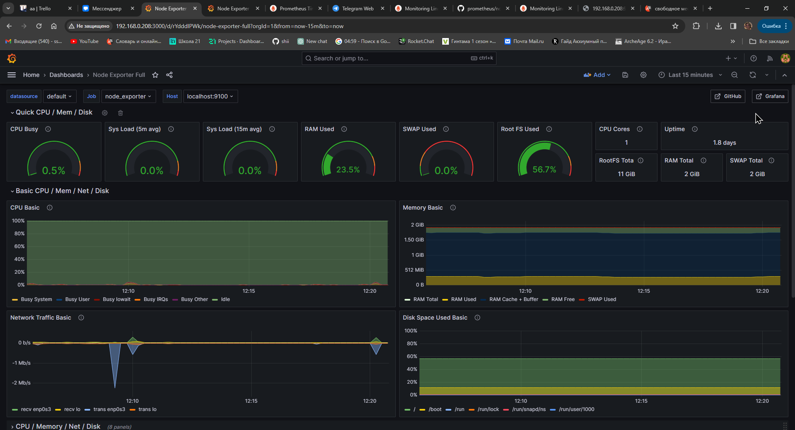

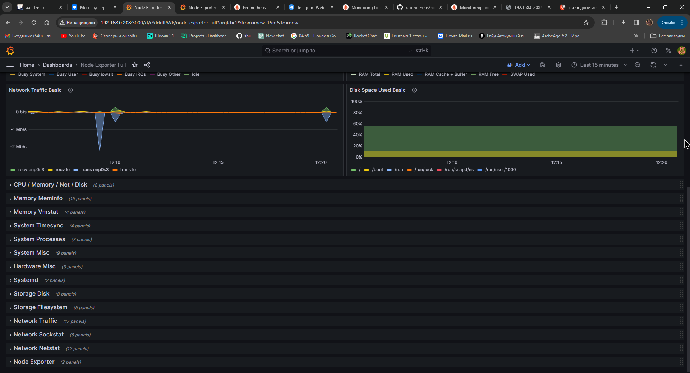

**2. Проведите те же тесты, что и в Части 7.**

- Запуск скрипта из части 2.

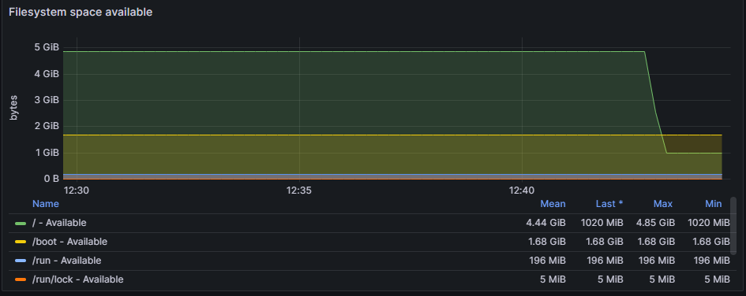

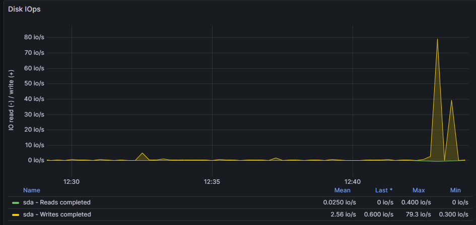

- Запуск утилиты stress.

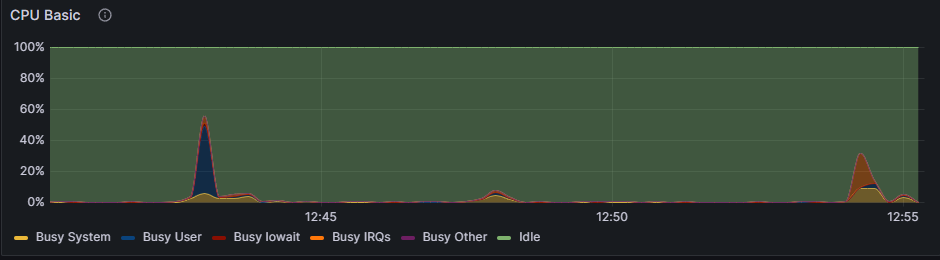

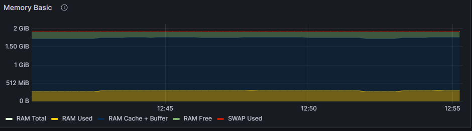

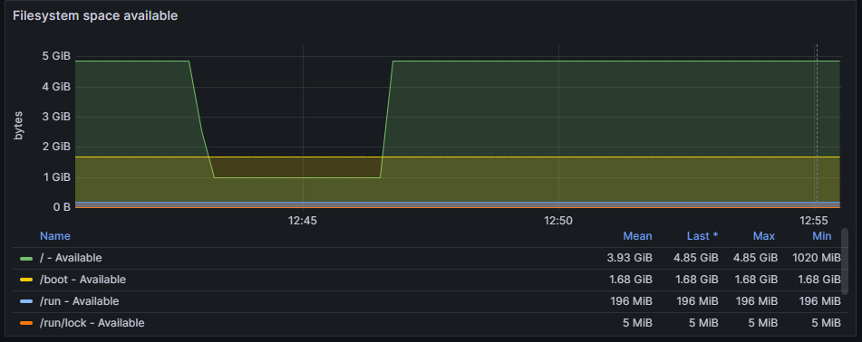

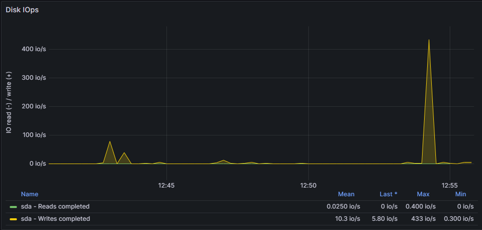

**3-4. Запустите ещё одну виртуальную машину, находящуюся в одной сети с текущей. Запустите тест нагрузки сети с помощью утилиты iperf3.**

- Запустила еще одну машину, добавив ей сетевой адаптер, настроенный на использование сетевого моста, такого же, как и первой виртуальной машины. Затем для iperf3 разрешила использовать порт 5201 на обеих машинах. 

**`sudo firewall-cmd --add-port=5201/tcp --permanent`**

**`sudo firewall-cmd --reload`**

- На первой машине использовала затем команду:

**`iperf3 -s`**

- А на второй команду:

**`iperf3 -c 192.168.0.208`**

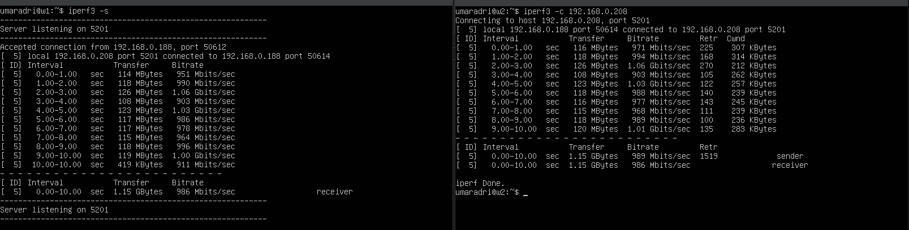

**5. Посмотрите на нагрузку сетевого интерфейса.**

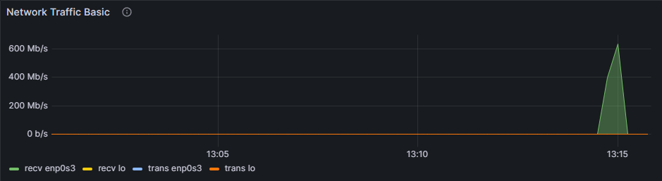